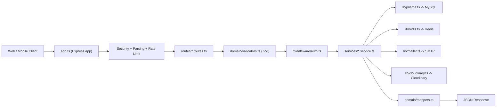
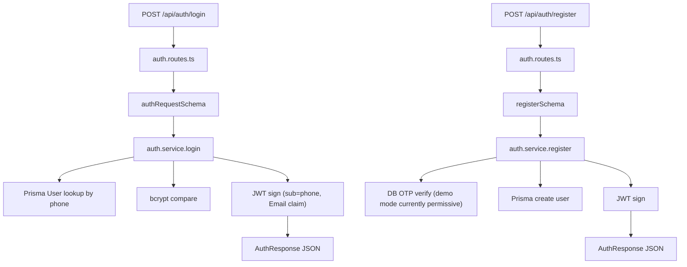
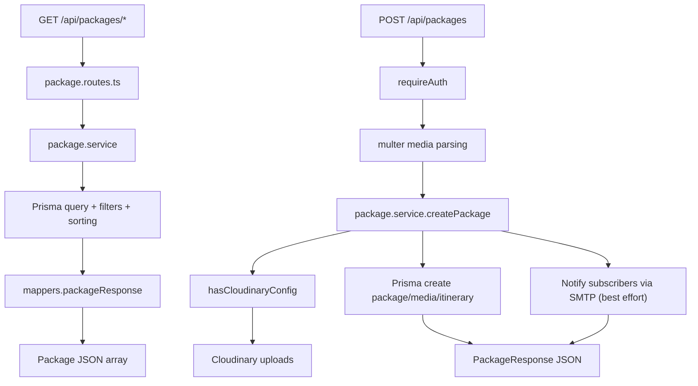
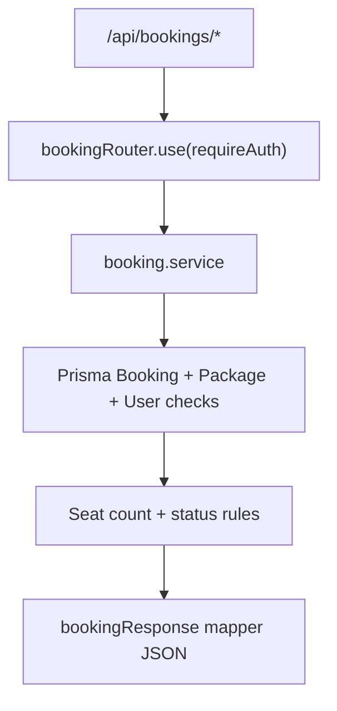
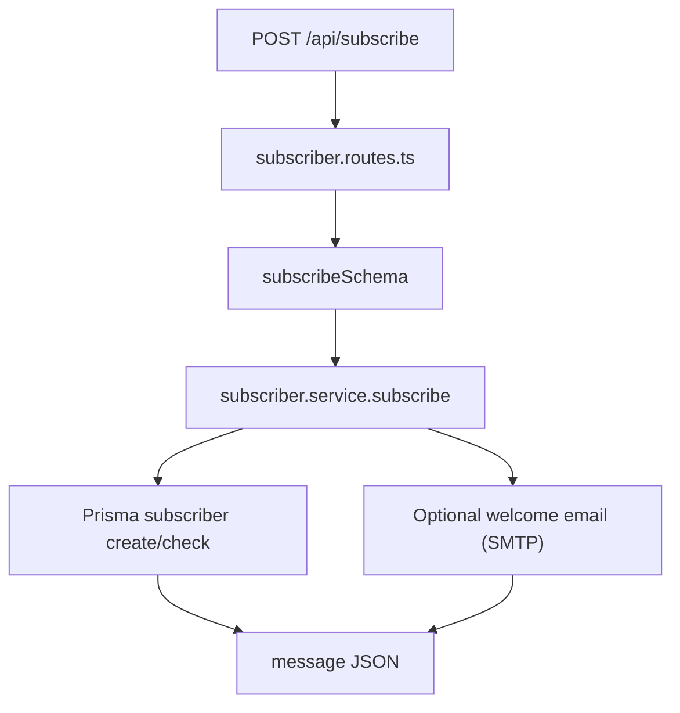

# PoolTrip `backendNode` Deep Code Guide

This document explains the `backendNode` repository in depth for:
- PMs who need product and API understanding
- Developers onboarding to the codebase
- QA/DevOps engineers validating behavior and integrations

It covers:
- Why each file/folder exists
- End-to-end request flow
- Full API catalog with auth rules and handler/service mapping
- Mermaid flowcharts for module-level behavior
- Demo `curl` requests for day-to-day testing

---

## 1) Repository Structure and Why Each Part Exists

> Path base: `backendNode/`

### Root files

- `package.json`
  - Project metadata, runtime dependencies (`express`, `@prisma/client`, `jsonwebtoken`, `ioredis`, `nodemailer`, `cloudinary`, `multer`, `zod`) and scripts (`dev`, `build`, `start`, Prisma commands).
  - This is the operational entry point for local/dev/prod workflows.

- `package-lock.json`
  - Dependency lockfile for reproducible installs.
  - Ensures all developers/CI use the same resolved package versions.

- `tsconfig.json`
  - TypeScript compiler settings (`strict` mode, NodeNext modules, `src` -> `dist`).
  - Enforces compile-time safety and consistent output.

- `.env.example`
  - Template for required environment variables (port, DB, JWT, Redis, Mail, Cloudinary).
  - New developers copy this into `.env` before running.

- `README.md`
  - Quick-start instructions for this Node backend.
  - Good for first run; this file (`READCODE.md`) is the deep reference.

### Database schema

- `prisma/schema.prisma`
  - Defines the MySQL schema and Prisma models:
    - `User`
    - `TravelPackage`
    - `PackageMedia`
    - `PackageItinerary`
    - `Booking`
    - `Subscriber`
    - `OtpVerification`
  - Includes enums (`PackageStatus`, `BookingStatus`) and relation mappings.
  - Single source of truth for data structure and migrations.

### Application bootstrap

- `src/server.ts`
  - Starts the HTTP server on `env.port`.

- `src/app.ts`
  - Builds the Express app:
    - Security middleware (`helmet`, CORS)
    - Body parsing (`json`, `urlencoded`)
    - Rate limiting for auth routes
    - Route mounting (`/api/auth`, `/api/packages`, `/api/bookings`, `/api/subscribe`)
    - Health endpoint (`/healthz`)
    - 404 and global error handling

### Config and infrastructure clients

- `src/config/env.ts`
  - Loads env (`dotenv/config`), validates required values, and exports typed config.
  - Centralizes environment access so services do not parse `process.env` directly.

- `src/lib/prisma.ts`
  - Shared singleton Prisma client.

- `src/lib/redis.ts`
  - Redis client for OTP storage and verification.

- `src/lib/mailer.ts`
  - SMTP transport setup and `hasMailConfig()` helper.
  - Used by OTP, subscribe welcome mail, and package notifications.

- `src/lib/cloudinary.ts`
  - Cloudinary SDK setup and `hasCloudinaryConfig()` helper.
  - Used for profile and package media uploads.

### Middleware layer

- `src/middleware/auth.ts`
  - JWT parsing and verification from `Authorization: Bearer <token>`.
  - `optionalAuth`: tries auth but does not fail public routes.
  - `requireAuth`: blocks unauthenticated access with `401`.
  - Injects `req.userPhone` and `req.userEmail` for downstream services.

- `src/middleware/error.ts`
  - Standard JSON error envelope:
    - Zod validation errors (`400`)
    - `ApiError` domain errors (custom status)
    - fallback `500`
  - Also provides standardized 404 handler.

### Domain layer

- `src/domain/validators.ts`
  - Zod schemas for request validation:
    - auth payloads
    - user update
    - package filters
    - booking payloads
    - subscribe payload

- `src/domain/mappers.ts`
  - Converts database rows into frontend/mobile-friendly API response shapes.
  - Keeps response formatting consistent across services.

- `src/domain/constants.ts`
  - Metadata dictionaries for transportation and package type labels/icons.
  - Used to enrich package/booking responses for UI display.

### Utility layer

- `src/utils/http.ts`
  - `ApiError` class
  - `asyncHandler` wrapper for route handlers
  - small numeric helper (`toNumber`)

- `src/utils/form.ts`
  - Helpers to parse multipart/form fields (arrays, booleans, numbers).
  - Useful for media upload payload normalization.

### Service layer (business logic)

- `src/services/auth.service.ts`
  - Register/login/JWT issuance
  - Current user and public user lookups
  - Profile updates
  - Phone OTP (DB-backed), email OTP (Redis-backed)
  - Password reset
  - Profile photo upload (Cloudinary)

- `src/services/package.service.ts`
  - Package listing/filtering/sorting
  - Create/update/delete package with multipart media
  - Geo-nearby style filtering logic
  - Status updates
  - Filter options aggregation for UI
  - Subscriber notification trigger after new package creation

- `src/services/booking.service.ts`
  - Booking lifecycle:
    - create
    - approve/reject
    - cancel
    - list host/passenger bookings
    - active booking status
    - rating
  - Maintains seat counts and package status transitions (`ACTIVE` <-> `FULL`).

- `src/services/subscriber.service.ts`
  - Newsletter subscription with duplicate prevention
  - Welcome email best-effort sending

### Route layer (HTTP -> service wiring)

- `src/routes/auth.routes.ts`
- `src/routes/package.routes.ts`
- `src/routes/booking.routes.ts`
- `src/routes/subscriber.routes.ts`

Each route file:
- validates input via Zod
- applies auth middleware where required
- invokes service methods
- returns JSON response

### Generated/runtime folders you will see

- `dist/` (generated by `npm run build`)
  - compiled JavaScript output from TypeScript
- `node_modules/` (generated by `npm install`)
  - installed dependencies
- `tmp/` (runtime; multer target)
  - temporary uploaded files during multipart handling

---

## 2) High-Level Architecture and Request Lifecycle



---

## 3) API Modules and Flow Paths

## 3.1 Auth Module Flow



## 3.2 Package Module Flow



## 3.3 Booking Module Flow



## 3.4 Subscribe Module Flow



---

## 4) Complete API Catalog (Method, Path, Auth, File Mapping)

### Auth APIs

| Method | Path | Auth | Route file | Service method | Purpose |
|---|---|---|---|---|---|
| POST | `/api/auth/register` | Public | `src/routes/auth.routes.ts` | `register` | Create account and return JWT |
| POST | `/api/auth/login` | Public | `src/routes/auth.routes.ts` | `login` | Authenticate and return JWT |
| GET | `/api/auth/me` | Bearer | `src/routes/auth.routes.ts` | `getCurrentUser` | Current logged-in user profile |
| PUT | `/api/auth/me` | Bearer | `src/routes/auth.routes.ts` | `updateCurrentUser` | Update editable profile fields |
| GET | `/api/auth/user/:id` | Public | `src/routes/auth.routes.ts` | `getUserById` | Public/limited user profile |
| POST | `/api/auth/forgot-password` | Public | `src/routes/auth.routes.ts` | `forgotPassword` | Trigger OTP flow for reset |
| POST | `/api/auth/reset-password` | Public | `src/routes/auth.routes.ts` | `resetPassword` | Reset password using OTP |
| POST | `/api/auth/send-otp` | Public | `src/routes/auth.routes.ts` | `sendOtpForRegistration` | Send registration OTP |
| POST | `/api/auth/email/send-otp` | Bearer | `src/routes/auth.routes.ts` | `sendEmailOtp` | Email verification OTP send |
| POST | `/api/auth/email/verify-otp` | Bearer | `src/routes/auth.routes.ts` | `verifyEmailOtp` | Verify email OTP and mark verified |
| POST | `/api/auth/me/profile-photo` | Bearer + multipart | `src/routes/auth.routes.ts` | `uploadProfilePhoto` | Upload profile photo to Cloudinary |

### Package APIs

| Method | Path | Auth | Route file | Service method | Purpose |
|---|---|---|---|---|---|
| GET | `/api/packages` | Public | `src/routes/package.routes.ts` | `listAll` | List packages with optional filters |
| GET | `/api/packages/active` | Public | `src/routes/package.routes.ts` | `listAll` | Active-only subset |
| GET | `/api/packages/featured` | Public | `src/routes/package.routes.ts` | `listFeatured` | Featured packages |
| GET | `/api/packages/filter-options` | Public | `src/routes/package.routes.ts` | `filterOptions` | Dynamic filter metadata |
| GET | `/api/packages/my-packages` | Bearer | `src/routes/package.routes.ts` | `myPackages` | Packages created by current user |
| GET | `/api/packages/user/:userId` | Public | `src/routes/package.routes.ts` | `byUserId` | Packages for specific user |
| GET | `/api/packages/type/:type` | Public | `src/routes/package.routes.ts` | `byType` | Type-based package list |
| GET | `/api/packages/type/:type/originLat/:originLat/originLong/:originLong` | Public | `src/routes/package.routes.ts` | `byTypeAndOrigin` | Type + origin proximity query |
| GET | `/api/packages/destination/destinationLat/:destinationLat/destinationLong/:destinationLong` | Public | `src/routes/package.routes.ts` | `byDestination` | Destination proximity query |
| GET | `/api/packages/search` | Public | `src/routes/package.routes.ts` | inline + `listAll` | Text search |
| GET | `/api/packages/search-nearby` | Public | `src/routes/package.routes.ts` | inline | Compatibility placeholder, returns `[]` |
| GET | `/api/packages/search-from-origin` | Public | `src/routes/package.routes.ts` | inline | Compatibility placeholder, returns `[]` |
| GET | `/api/packages/:id` | Public | `src/routes/package.routes.ts` | `byId` | Single package detail |
| POST | `/api/packages` | Bearer + multipart | `src/routes/package.routes.ts` | `createPackage` | Create package with media |
| PUT | `/api/packages/:id` | Bearer + multipart | `src/routes/package.routes.ts` | `updatePackage` | Update package and media |
| DELETE | `/api/packages/:id` | Bearer | `src/routes/package.routes.ts` | `deletePackage` | Delete own package |
| PATCH | `/api/packages/:id/status?status=...` | Bearer | `src/routes/package.routes.ts` | `updateStatus` | Update package status |

### Booking APIs

| Method | Path | Auth | Route file | Service method | Purpose |
|---|---|---|---|---|---|
| POST | `/api/bookings` | Bearer | `src/routes/booking.routes.ts` | `createBooking` | Create booking request |
| POST | `/api/bookings/:id/approve` | Bearer | `src/routes/booking.routes.ts` | `approveBooking` | Host approves pending booking |
| POST | `/api/bookings/:id/reject` | Bearer | `src/routes/booking.routes.ts` | `rejectBooking` | Host rejects pending booking |
| POST | `/api/bookings/:id/cancel` | Bearer | `src/routes/booking.routes.ts` | `cancelBooking` | Passenger cancels booking |
| GET | `/api/bookings/my` | Bearer | `src/routes/booking.routes.ts` | `myBookings` | Passenger booking list |
| GET | `/api/bookings/host` | Bearer | `src/routes/booking.routes.ts` | `hostBookings` | Host booking list |
| GET | `/api/bookings/host/pending` | Bearer | `src/routes/booking.routes.ts` | `hostBookings` | Host pending-only list |
| GET | `/api/bookings/status/:packageId` | Bearer | `src/routes/booking.routes.ts` | `bookingStatus` | Current user active booking state for package |
| POST | `/api/bookings/:id/rate` | Bearer | `src/routes/booking.routes.ts` | `rateBooking` | Submit trip rating/review |

### Subscribe API

| Method | Path | Auth | Route file | Service method | Purpose |
|---|---|---|---|---|---|
| POST | `/api/subscribe` | Public | `src/routes/subscriber.routes.ts` | `subscribe` | Newsletter subscription |

---

## 5) Environment Variables by Responsibility

| Variable | Required | Used in |
|---|---|---|
| `PORT` | No (default 8091) | `src/server.ts` via `src/config/env.ts` |
| `NODE_ENV` | No | `src/config/env.ts`, `/healthz` output |
| `DATABASE_URL` | Yes for DB operations | Prisma datasource in `prisma/schema.prisma` |
| `JWT_SECRET` | Yes | `src/middleware/auth.ts`, `src/services/auth.service.ts` |
| `JWT_EXPIRATION_MS` | No (default 86400000) | `src/services/auth.service.ts` |
| `REDIS_HOST`, `REDIS_PORT` | Needed for email OTP | `src/lib/redis.ts`, `src/services/auth.service.ts` |
| `MAIL_HOST`, `MAIL_PORT`, `MAIL_USER`, `MAIL_PASS`, `MAIL_FROM` | Needed for email features | `src/lib/mailer.ts`, auth/subscriber/package services |
| `CLOUDINARY_CLOUD_NAME`, `CLOUDINARY_API_KEY`, `CLOUDINARY_API_SECRET` | Needed for uploads | `src/lib/cloudinary.ts`, auth/package services |
| `FRONTEND_BASE_URL` | Optional but recommended | `src/services/package.service.ts` email link generation |
| `APP_BASE_URL` | Optional (currently reserved) | Parsed in `src/config/env.ts` |

---

## 6) Demo `curl` Commands

Set a base URL first:

```bash
export API_BASE_URL="http://localhost:8091/api"
```

### 6.1 Auth

Register:

```bash
curl -X POST "$API_BASE_URL/auth/register" \
  -H "Content-Type: application/json" \
  -d '{
    "email": "demo.user@example.com",
    "password": "StrongPass123",
    "fullName": "Demo User",
    "phone": "9876543210",
    "Otp": "123456",
    "whatsappNumber": "9876543210"
  }'
```

Login:

```bash
curl -X POST "$API_BASE_URL/auth/login" \
  -H "Content-Type: application/json" \
  -d '{
    "phone": "9876543210",
    "password": "StrongPass123"
  }'
```

Save token:

```bash
export TOKEN="<paste-token-from-login>"
```

Get current user:

```bash
curl "$API_BASE_URL/auth/me" \
  -H "Authorization: Bearer $TOKEN"
```

Update current user:

```bash
curl -X PUT "$API_BASE_URL/auth/me" \
  -H "Authorization: Bearer $TOKEN" \
  -H "Content-Type: application/json" \
  -d '{
    "fullName": "Demo User Updated",
    "bio": "Love travel planning",
    "whatsappNumber": "9876543210"
  }'
```

Send email OTP:

```bash
curl -X POST "$API_BASE_URL/auth/email/send-otp" \
  -H "Authorization: Bearer $TOKEN" \
  -H "Content-Type: application/json" \
  -d '{"email":"demo.user@example.com"}'
```

Verify email OTP:

```bash
curl -X POST "$API_BASE_URL/auth/email/verify-otp" \
  -H "Authorization: Bearer $TOKEN" \
  -H "Content-Type: application/json" \
  -d '{"otp":"123456"}'
```

### 6.2 Packages

List all packages:

```bash
curl "$API_BASE_URL/packages"
```

List with filters:

```bash
curl "$API_BASE_URL/packages?minPrice=2000&maxPrice=15000&minDays=2&maxDays=7&featured=true"
```

Get package by id:

```bash
curl "$API_BASE_URL/packages/1"
```

Create package with media:

```bash
curl -X POST "$API_BASE_URL/packages" \
  -H "Authorization: Bearer $TOKEN" \
  -F "title=Shimla Weekend Escape" \
  -F "description=Comfort trip to the hills" \
  -F "origin=Chandigarh" \
  -F "originLatitude=30.7333" \
  -F "originLongitude=76.7794" \
  -F "destination=Shimla" \
  -F "destinationLatitude=31.1048" \
  -F "destinationLongitude=77.1734" \
  -F "price=5999" \
  -F "discountedPrice=4999" \
  -F "durationDays=3" \
  -F "durationNights=2" \
  -F "totalSeats=10" \
  -F "availableSeats=10" \
  -F "startDate=2026-05-20" \
  -F "packageType=HILLS" \
  -F "transportation=BUS_AC" \
  -F "featured=true" \
  -F "instantBooking=true" \
  -F "itinerary[0]=Pickup and transfer" \
  -F "itinerary[1]=Local sightseeing" \
  -F "itinerary[2]=Return journey" \
  -F "media=@/absolute/path/to/photo1.jpg" \
  -F "media=@/absolute/path/to/video1.mp4"
```

Update package status:

```bash
curl -X PATCH "$API_BASE_URL/packages/1/status?status=FULL" \
  -H "Authorization: Bearer $TOKEN"
```

### 6.3 Bookings

Create booking:

```bash
curl -X POST "$API_BASE_URL/bookings" \
  -H "Authorization: Bearer $TOKEN" \
  -H "Content-Type: application/json" \
  -d '{
    "packageId": 1,
    "seats": 2,
    "message": "Looking forward!"
  }'
```

Approve booking (host):

```bash
curl -X POST "$API_BASE_URL/bookings/10/approve" \
  -H "Authorization: Bearer $TOKEN"
```

Reject booking (host):

```bash
curl -X POST "$API_BASE_URL/bookings/10/reject" \
  -H "Authorization: Bearer $TOKEN"
```

Cancel booking (passenger):

```bash
curl -X POST "$API_BASE_URL/bookings/10/cancel" \
  -H "Authorization: Bearer $TOKEN"
```

My bookings:

```bash
curl "$API_BASE_URL/bookings/my" \
  -H "Authorization: Bearer $TOKEN"
```

Rate booking:

```bash
curl -X POST "$API_BASE_URL/bookings/10/rate" \
  -H "Authorization: Bearer $TOKEN" \
  -H "Content-Type: application/json" \
  -d '{
    "rating": 5,
    "review": "Great trip and host"
  }'
```

### 6.4 Subscribe

```bash
curl -X POST "$API_BASE_URL/subscribe" \
  -H "Content-Type: application/json" \
  -d '{
    "email":"subscriber@example.com"
  }'
```

---

## 7) Quick PM Summary (Non-Technical)

- This backend is split by business module: authentication, packages, bookings, and subscriptions.
- Security is enforced through JWT for protected actions and request validation for input safety.
- Integrations are modular:
  - MySQL for core data
  - Redis for OTP
  - Cloudinary for media
  - SMTP for email
- The API is organized under `/api/*` and aligns with frontend/mobile client expectations.

---

## 8) Quick Developer Onboarding Checklist

1. Copy `.env.example` -> `.env` and fill secrets.
2. Run `npm install`.
3. Run `npm run prisma:generate`.
4. Run `npm run dev`.
5. Hit `GET /healthz`.
6. Use the `curl` section above to validate each module end-to-end.

---

If you want, next I can generate a second file `API_TEST_COLLECTION.md` with an ordered smoke-test script (copy-paste sequence) that covers all endpoints with expected success/error responses.
